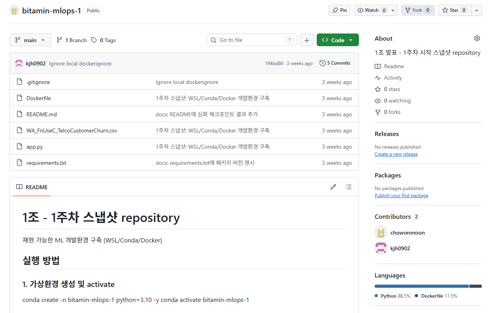
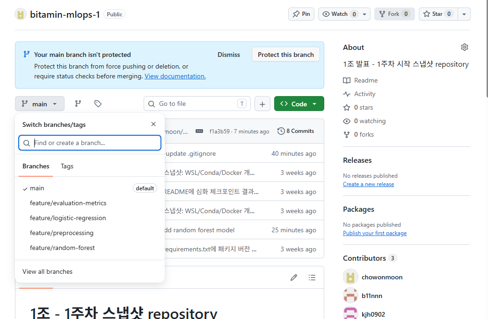
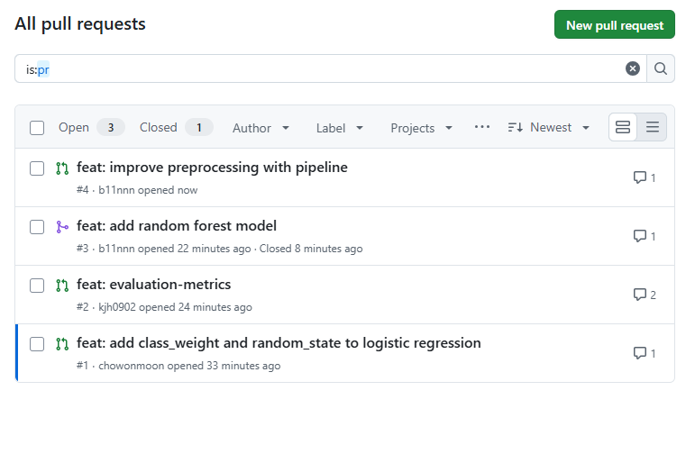
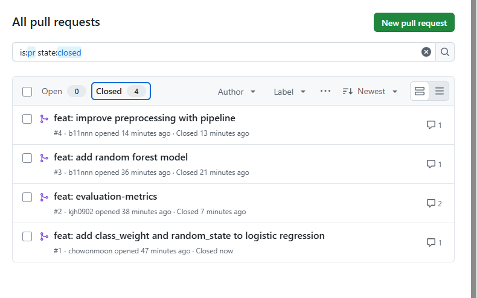
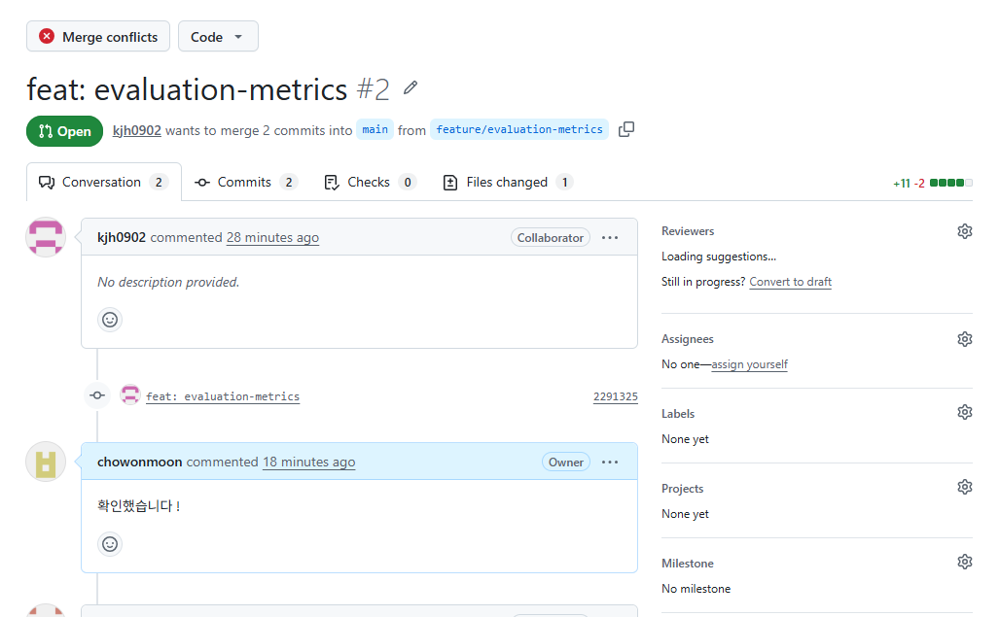
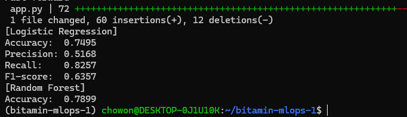

# Week2 - Git / GitHub 기반 협업

## 체크포인트 1. 조별 Repository 개설 및 1주차 결과물 Push
- 실행 명령어
```bash
git remote set-url origin git@github.com:chowonmoon/bitamin-mlops-1.git
git remote -v
git push -u origin main
```
- 결과 화면



## 체크포인트 2. 조원 전원이 각자 Branch 생성 후 작업
- 역할 분배

| 담당 | Branch | 작업 |
|---|---|---|
| A | feature/preprocessing | Pipeline 기반 전처리 |
| B | feature/logistic-regression | class_weight, random_state 추가 |
| C | feature/random-forest | Random Forest 모델 추가 |
| D | feature/evaluation-metrics | Precision / Recall / F1 추가 |

- 실행 명령어
```bash
git switch main
git pull origin main
git switch -c feature/logistic-regression
git branch
git push -u origin feature/logistic-regression
```
- 결과 화면



## 체크포인트 3. 조원 전원이 PR 생성 및 최소 1건 Review Comment
- 실행 명령어
```bash
git add app.py
git commit -m "feat: add class_weight and random_state to logistic regression"
git push
```
- GitHub에서 base: main / compare: 각자 브랜치로 PR 생성 후 서로 리뷰 코멘트 작성
- 결과 화면



- 막혔던 지점: 리뷰 전에 random-forest PR을 먼저 merge함 → merge된 PR에 리뷰 코멘트를 추가로 작성

## 체크포인트 4. 모든 PR Merge 완료
- merge 순서: random-forest → preprocessing → evaluation-metrics → logistic-regression
- 결과 화면



## 체크포인트 5. Merge Conflict 1건 이상 발생 및 해결
- 실행 명령어
```bash
git fetch
git switch feature/evaluation-metrics
git merge origin/main
# app.py 충돌 구간에서 RF 학습 코드와 평가 지표 코드를 모두 살려 병합
git add app.py
git commit -m "fix: resolve merge conflict"
git push
```
- 결과 화면



- 막혔던 지점: random-forest가 먼저 merge되면서 evaluation-metrics(8번 평가)와 logistic-regression(LR 모델 줄)에서 충돌 → 로컬에서 origin/main을 merge한 뒤 양쪽 변경을 모두 살려 해결

## 최종 출력
```bash
git switch main
git pull
python app.py
```


